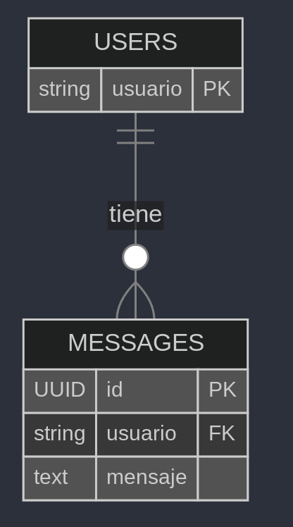
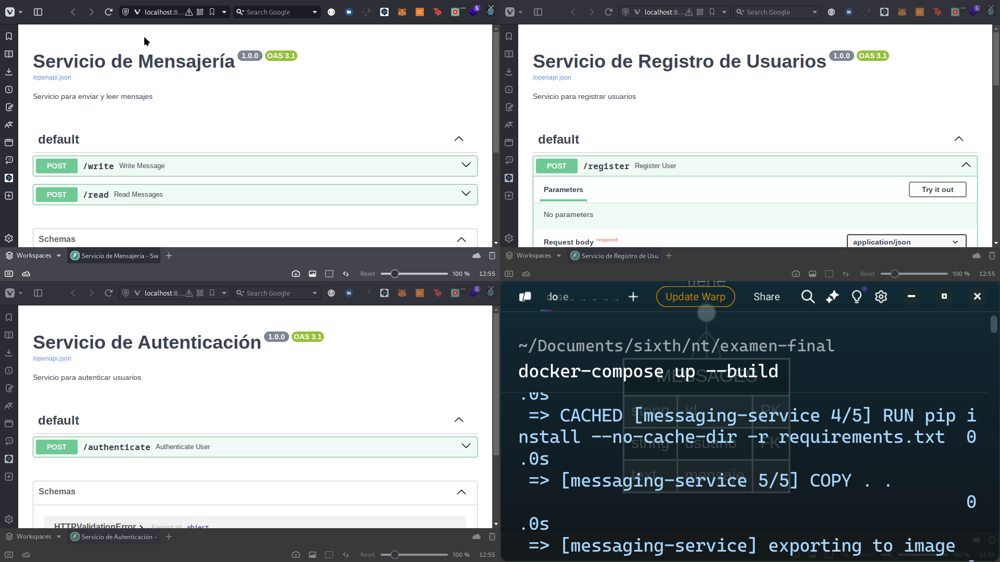
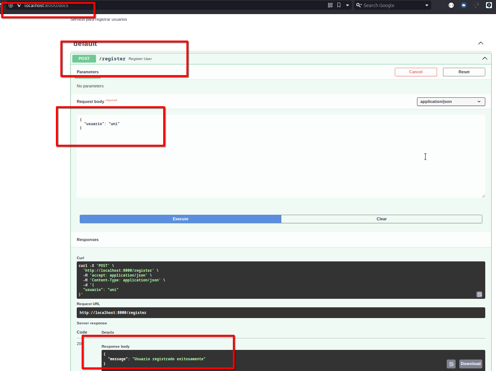
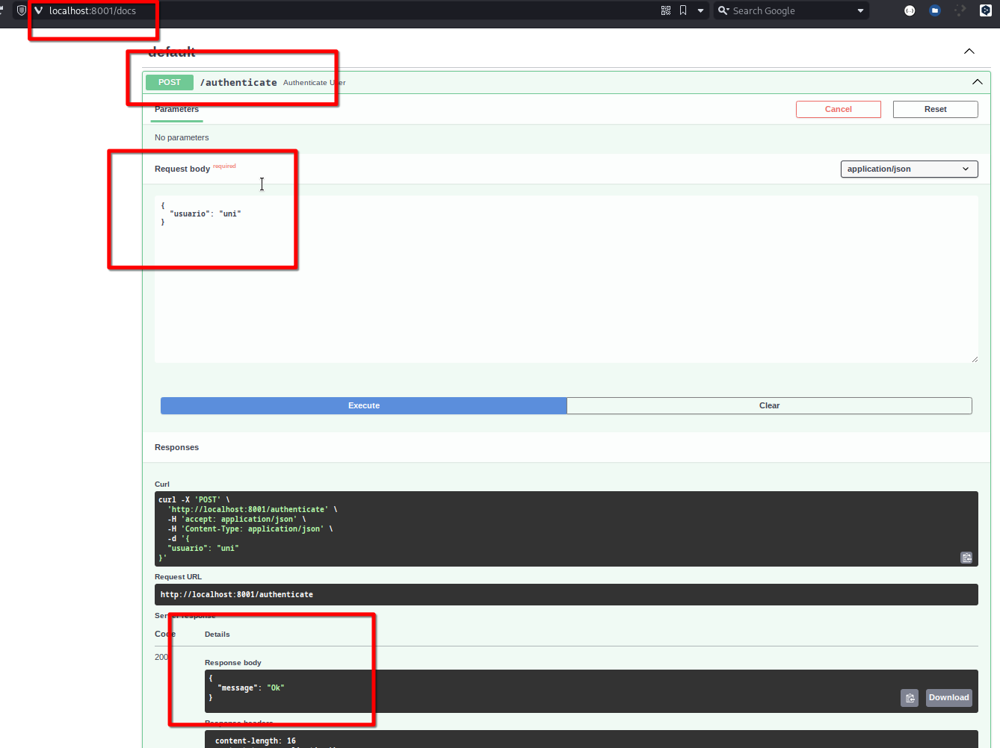
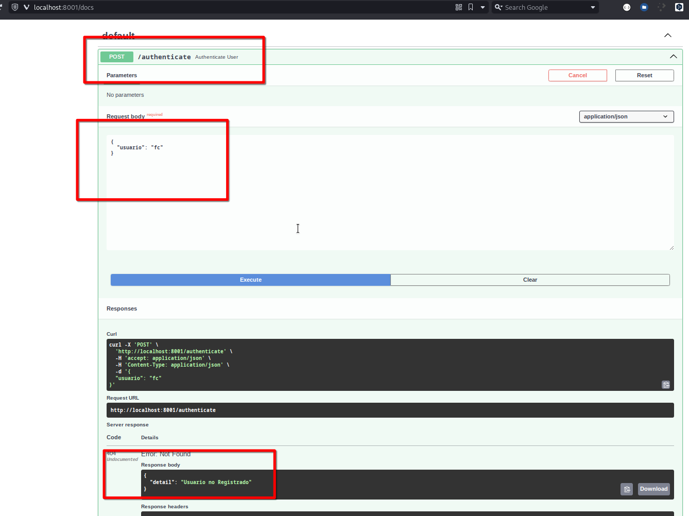
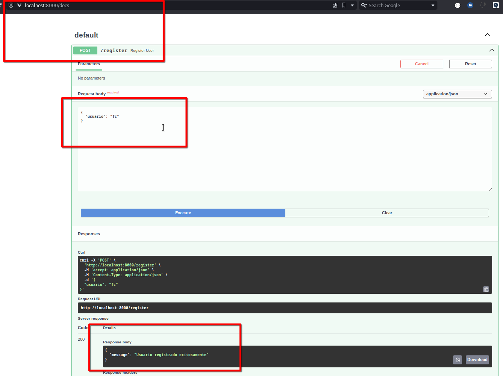
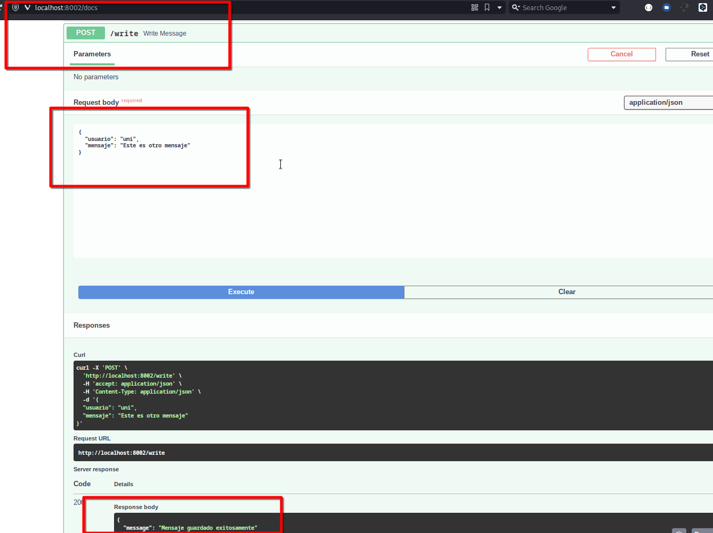
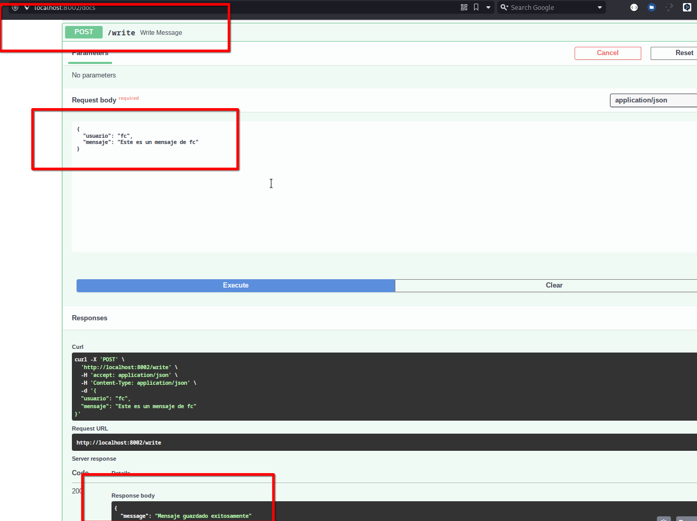
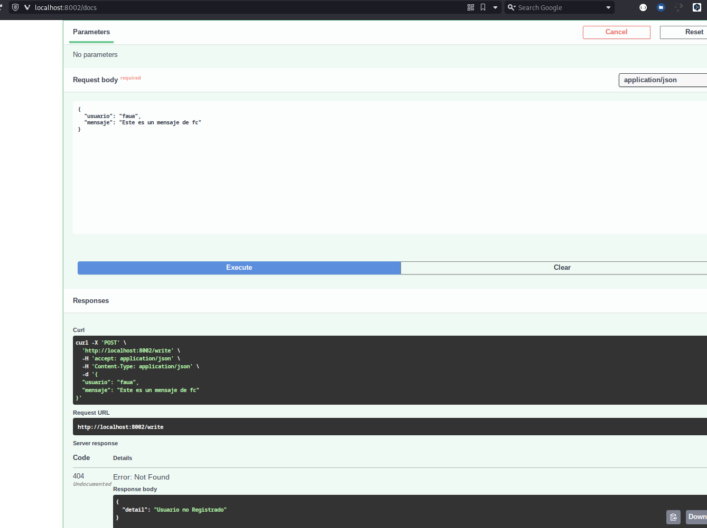
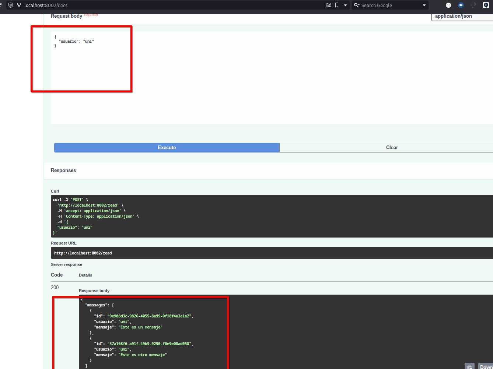

# Examen Final - CC312
Sergio Sebastian Pezo Jimenez - 20224087G

---

## Sistema de Mensajería con Microservicios

## Indice 

- [Examen Final - CC312](#examen-final---cc312)
  - [Sistema de Mensajería con Microservicios](#sistema-de-mensajería-con-microservicios)
  - [Indice](#indice)
  - [Requisitos](#requisitos)
  - [Inicio Rápido](#inicio-rápido)
  - [Estructura del Proyecto](#estructura-del-proyecto)
  - [Servicios](#servicios)
    - [Librerías Utilizadas](#librerías-utilizadas)
    - [Base de datos](#base-de-datos)
    - [Servicio de Registro](#servicio-de-registro)
    - [Servicio de Autenticación](#servicio-de-autenticación)
    - [Servicio de Mensajería](#servicio-de-mensajería)
  - [Pruebas del Sistema](#pruebas-del-sistema)


Sistema distribuido de mensajería compuesto por tres microservicios: registro, autenticación y mensajería, implementados con FastAPI y PostgreSQL.

## Requisitos

- Docker
- Docker Compose
- Make (opcional)

## Inicio Rápido

1. Clone el repositorio
2. Ejecute el sistema con:
```bash
make run
```
Si no tiene Make instalado, puede usar:

```sh
docker-compose up --build -d
```

## Estructura del Proyecto


```
.
├── auth-service
│   ├── app.py
│   ├── Dockerfile
│   └── requirements.txt
├── compose.yml
├── doc
│   └── Examen-Final.md
├── Makefile
├── messaging-service
│   ├── app.py
│   ├── Dockerfile
│   └── requirements.txt
└── register-service
    ├── app.py
    ├── Dockerfile
    └── requirements.txt
```


## Servicios


### Librerías Utilizadas
- FastAPI: Framework web moderno y rápido
- SQLAlchemy: ORM para interacción con base de datos
- Pydantic: Validación de datos
- Uvicorn: Servidor ASGI
- Psycopg2: Driver de PostgreSQL
- Requests: Cliente HTTP para comunicación entre servicios


El sistema expone tres servicios en los siguientes puertos, que se definieron en el archivo `compose.yml`, este archivo compose.yml asegura que todos los servicios necesarios se configuren y se inicien en el orden correcto, con las dependencias adecuadas y la configuración de red necesaria para que se comuniquen entre sí.Para probar nuestros endpoints vamos a usar el swagger de FastApi.

### Base de datos

Se crearon dos tablas para manejar a los usuarios y sus mensajes




### Servicio de Registro
Puerto: 8000
Endpoint: POST /register
Función: Registra nuevos usuarios en el sistema
Tecnologías: FastAPI, SQLAlchemy
Dependencias: PostgreSQL


### Servicio de Autenticación
- Puerto: 8001
- Endpoint: POST /authenticate
- Función: Verifica si un usuario existe en el sistema
- Tecnologías: FastAPI, SQLAlchemy
- Dependencias: PostgreSQL


### Servicio de Mensajería
- Puerto: 8002
- Endpoints:
    - POST /write: Escribe mensajes
  - POST /read: Lee mensajes
- Función: Gestiona el envío y lectura de mensajes
- Tecnologías: FastAPI, SQLAlchemy, Requests
- Dependencias: PostgreSQL, Servicio de Autenticación


## Pruebas del Sistema


A continuación se muestra los servicios funcionando correctamente luego de ejecutar nuestro comando.



Ahora procedamos a probar nuestro endpoints para simular el ejemplo.

Registro de Usuario "uni" 



Autenticación exitosa de "uni"



Intento de autenticación fallido de "fc", pues no registramos a ningun usuario fc.



Así que primero registremoslo, registro de usuario "fc" 



Finalmente procedamos a probar nuestro servicio de envío y lectura de mensajes.


Mensaje 1 desde "uni"


Mensaje 2 desde "uni"



Mensaje 3 desde "fc"



Intento fallido desde "faua" , el cual nos devolverá usuario no registrado, pues no lo registramos previamente:



Finalmente nuestro último endpoint para hacer lectura de los mensajes de "uni" 



El cual contiene los mensajes previamente escritos

Logrando finalmente obtener lo esperado. :)


